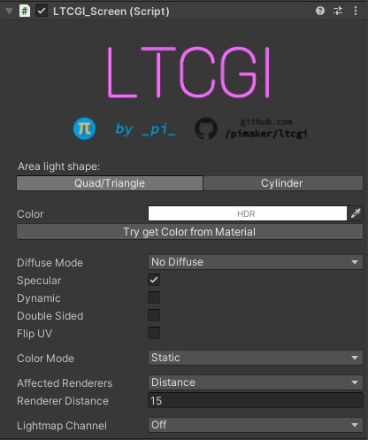

# 5️⃣ The `LTCGI_Screen` component

The `LTCGI_Screen` component is the most important part of LTCGI. This is what controls the emission of light into your scene.

It must be placed on an object containing a `Mesh Filter` (generally in combination with a `Mesh Renderer`, but that part is not mandatory - you can have an invisible light source that way). Light will be emitted (and reflected) in the shape of the mesh selected on the `Mesh Filter`. **The mesh must have exactly 3 or 4 vertices!** UV Maps are supported, so textured light sources (video or static) can be UV'd.

> ⚠️ NOTE: There is also the `LTCGI_Emitter` component, which can only emit non-textured, baked diffuse light, but has no geometry restrictions. _Most likely_ you want to use an `LTCGI_Screen` component.

To create a light source, place a 4-vertex mesh into your scene (Unity's built-in Quad will do) and add the component in the inspector window. If you have completed the previous step and are using an LTCGI-enabled material, you should see the mesh start to emit white light.

> ⚠️ Note that disabling GameObjects or components with a screen or emitter on them is **not supported**, neither in editor nor in-game! Check "Basic Toggle" to see how you can enable or disable LTCGI globally. Setting the color to Black (0,0,0) will disable a single screen entirely, such that it can be re-enabled via `_SetColor` using the [UdonSharp API](/Advanced/Udon_Sharp_API).

If it doesn't immediately work, try hitting "CTRL-S" to save your scene. This will force an LTCGI update as well, it's generally a good idea to keep hitting that while working on ~~an LTCGI project~~ any Unity project. Backups as well, people!

<video controls loop width="100%">
  <source src="/vid/create_quad_1.webm"/>
</video>

---

## Mesh Rendering

It is very important to understand that the component _only_ defines how the light is rendered. It does _not_ change the appearance of the mesh itself! For example, you can have a blue mesh with an orange light:

You need to ensure that the mesh itself looks the same as the light it emits yourself, usually by changing the normal material on the Renderer!

---

## Component Settings

### Basic Settings

| | |
|-|-|
| Area light shape | Defines the type of light mesh. `Quad/Triangle` allows you to use any mesh with 3 or 4 vertices. `Cylinder` is **experimental** and allows you to define a cylindrical shape that will emit light. |
| Color | The base color of this light. Will also be applied on textured lights as a multiplier, leave as White (1,1,1) to show textures unmodified. *Supports HDR to increase brightness!* |
| Try get Color from Material | Tries to load the exact color used on the Renderer's material (as `_Color`). |

### Light Settings

| | |
|-|-|
| Diffuse Mode | Defines how the light emits diffuse light. Options are `No Diffuse` to disable for performance, `LTC Diffuse` to use the LTC algorithm's version of diffuse or `Lightmap Diffuse` to directly use the data calculated in the [Shadowmap](/Advanced/Shadowmaps) bake. It is recommended to try these options in your particular environment, often times specular is enough, and diffuse can be left off for increased performance. |
| Specular | Determines if specular light is emitted (reflections). |
| Dynamic | Marks this screen as dynamic. Comes with slight performance overhead, but allows moving the screen and changing its color at runtime. |
| Double Sided | If this screen emits light on both sides of the mesh. |
| Flip UV | Workaround. Some models imported from Blender or other 3D software can have flipped reflections. If you notice this, you can set this flag to un-flip them. (If anyone can tell me why this happens and has a more permanent fix, please let me know!) |

### Color Mode

The `Color Mode` property describes where the color for the light is coming from. It has 4 options:

| | |
|-|-|
| Static | The entire screen is lit up in the color set on the component. |
| Texture | The screen takes it's color values from a texture. This texture can be specified with the slider labeled `Texture Index`, which will select either the live video texture (0) or any one of the [Static Textures](/Advanced/Static_Textures) you previously added to the Controller. |
| Single UV | Like `Texture`, but will light up the screen in a single color taken from the texture at the exact UV coordinate you specify below. |
| Audio Link | See [AudioLink](/Advanced/Audiolink). |

### Affected Renderers

Selects which Renderers in your scene should receive light from this screen. See the section on [Performance Optimization](/Advanced/Performance_Optimization) for more.

### Lightmap Channel

Selects which lightmap channel this screen will occupy when baking a shadowmap. See section on [Shadowmaps](/Advanced/Shadowmaps) for more.