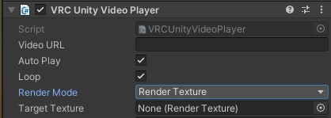

# 6️⃣ Realtime Video

This section assumes that you have completed the previous ones and have a static quad set up, that successfully casts a single-colored light onto your scene. If not, please read the previous "Getting Started" entries. Follow the numbers! (🔢)

The main reason you probably want to use LTCGI for is to reflect realtime video. If you made it this far, the only thing stopping you now is getting the video into the LTCGI controller. There are 2 main ways of doing so:

---

## Video Player Adapters

LTCGI comes with ready-made adapters for certain major VRChat video players. This option is only available for the VRChat version of LTCGI. To get started, download the right adapter for your video player from the [Releases](https://github.com/PiMaker/ltcgi/releases) tab.

`ltcgi-adapter-protv.unitypackage` - Adapter package for [ProTV video player](https://architechvr.gumroad.com/l/protv)  
`ltcgi-adapter-usharp-video.unitypackage` - Adapter package for [USharpVideo](https://github.com/MerlinVR/USharpVideo)

After importing the correct adapter package (_after_ importing the corresponding video player!), your LTCGI Controller should detect any video players of the specified type automatically. Press the offered button to perform the automatic setup.

When the setup is done, you need to ensure that the Quad generated by LTCGI matches with your actual video screen position. To do so, you can enable its `Mesh Renderer` component to see where it is in your scene. **Make sure to disable the `Mesh Renderer` afterwards, if you do enable it!**

Do _not_ do anything else to either the video player, the LTCGI Controller or the LTCGI Screen component! **All settings are configured automatically, and are ready to go!** Upload your world to VRChat and test in-game to see if it worked.

Here's all that in video form:

<video controls loop width="100%">
  <source src="/vid/usharp_video_setup.webm"/>
</video>

---

## Manual Setup

You do not need to use the provided adapters, e.g. if you are using a custom or unsupported video player, or are an advanced user that requires full control over what is being reflected.

**Unity Video Player**

The built-in Unity Video Player supports Render Texture output. To use it, simply create a new Render Texture (set the size to whatever your video will be, e.g. 1920x1080) and put it into the "Target Texture" slot of your player component.

Then put your created Render Texture into the "Video Texture" slot on the LTCGI Controller, and display it on your screen by putting it as the main texture of either an "Unlit/Texture" or custom screen shader material.

**AVPro**

To use AVPro, you can use the included `LTCGI_AvProBlit_Material` and `LTCGI_BlitCRT` in `_pi_/_LTCGI/Adapters` (you do not need to include any adapter packages for these files to exist!).

Increase the "Materials" array of your screen's mesh renderer to 2. Ignore the warning Unity will give you. As the first material, put AvProBlit, as the second your normal screen material. In your screen material, put the `BlitCRT` as the base texture. After doing this, your skybox in the editor may look a bit weird ("cut in half diagonally"), this is an editor-only bug and will work correctly in-game. :unity_rainbow:

On The `AVPro Video Screen` component, make sure that **"Use Shared Material" is checked**!

You can also do this via 2 seperate GameObjects (i.e. only have the `AvProBlit` material on your AVPro screen component, and render the `BlitCRT` elsewhere as your screen), which _may_ lead to better latency between the reflection and what is shown on screen. YMMV, and this is left as an exercise to the reader.